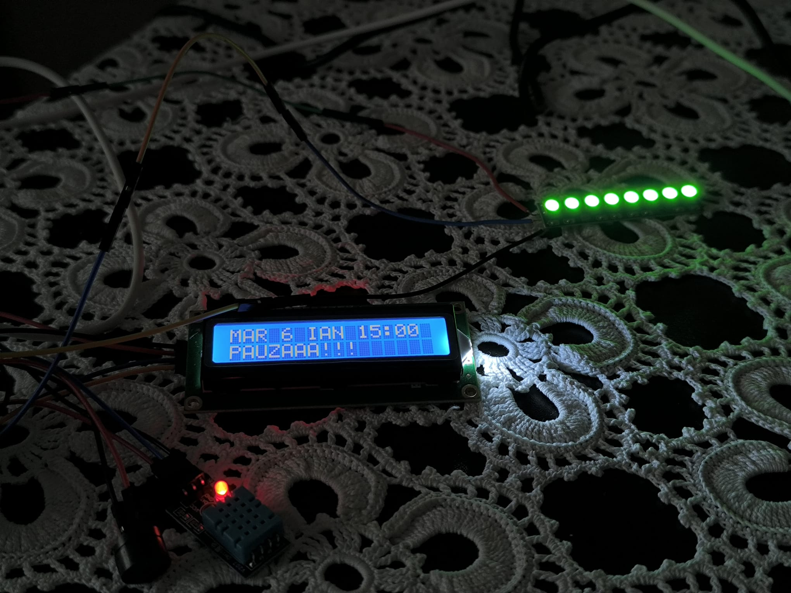
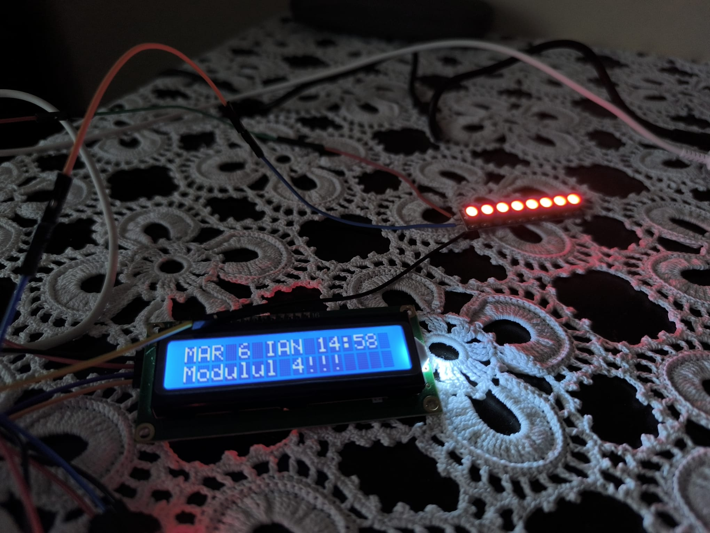
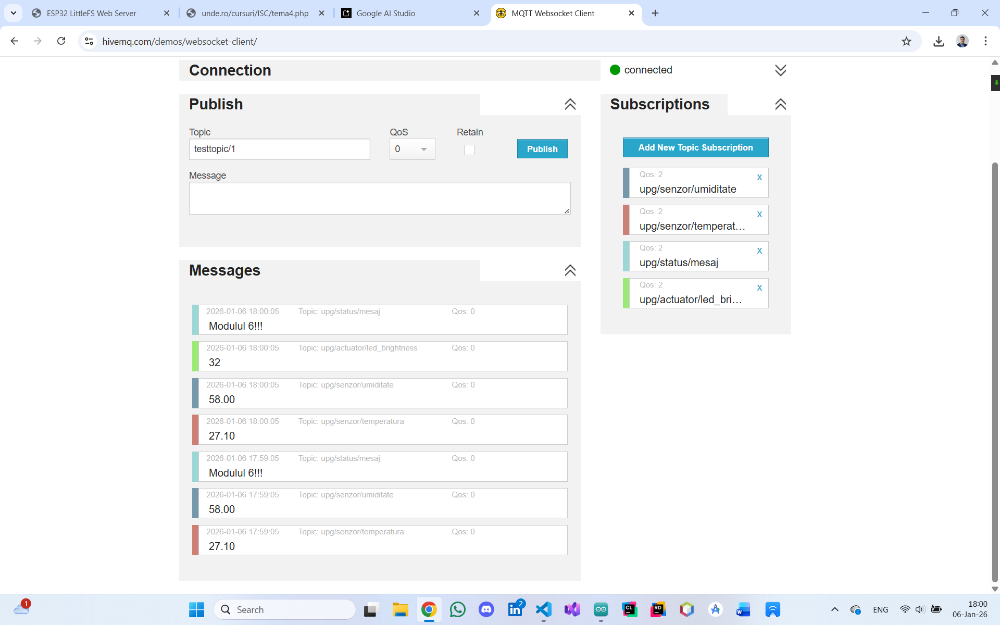

# UPG Modules Alarm Clock

## Project Overview
This project consists of a smart alarm clock designed for students and faculty at the Petroleum-Gas University of Ploiești (UPG). The system tracks the university's academic schedule, indicating whether a class module is in progress, if there is a break, or if classes have ended for the day. It combines environmental monitoring, visual and audible signaling, and data logging into a single IoT device.

## Project Gallery
<table>
<tr>
<td> </td>
<td> </td>
</tr>
<tr>
<td> </td>
<td> </td>
</tr>
</table>

## Features
- **Real-Time Schedule Tracking**: Displays the current academic module or break status based on the UPG timetable.
- **Time Synchronization**: Uses the Network Time Protocol (NTP) to maintain accurate time and date.
- **Visual Signaling**: A WS2812B LED strip changes color based on status (Red for modules, Green for breaks/free time).
- **Audible Alarm**: A passive buzzer sounds at the start and end of modules and breaks.
- **Environmental Monitoring**: Measures ambient temperature and humidity using a DHT11 sensor.
- **Web Interface**: A mobile-responsive dashboard to monitor sensor data, view the schedule, and adjust LED brightness.
- **Data Logging**: Records sensor readings and actuator states into CSV files stored locally on the device's flash memory.
- **Remote Monitoring**: Publishes real-time data to an MQTT broker for remote integration.

## Hardware Components
- **Microcontroller**: ESP32S
- **Display**: LCD I2C 1602 (with I2C adapter)
- **Sensors**: DHT11 Temperature and Humidity sensor
- **Actuators**: 
    - WS2812B LED Strip (8-bit NeoPixel)
    - Passive Buzzer (12mm)
- **Power & Connectivity**: Conductive wires and 5V/3.3V power sources provided by the ESP32.

## Pin Mapping
The connections are configured as follows:
- **LCD I2C 1602**: VCC to 5V (VN), SDA to Pin D21, SCL to Pin D22.
- **WS2812B LED Strip**: VCC to 5V, DIN to Pin 18.
- **DHT11 Sensor**: VCC to 3.3V, DIN to Pin 26.
- **Passive Buzzer**: Positive terminal to Pin D25.

## Software Architecture
The system is built using the Arduino framework for ESP32 and utilizes several key technologies:
- **Web Server**: `ESPAsyncWebServer` provides a high-performance web interface.
- **File System**: `LittleFS` is used to store the web assets (HTML/CSS) and logging files (`logs.csv` and `actuators.csv`).
- **Communication Protocols**: 
    - **NTP**: For automatic time synchronization.
    - **MQTT**: To send data to a central server (configured for `informatica2.upg-ploiesti.ro`).
    - **HTTP**: For the web-based monitoring and configuration.

## Functional Logic
The main logic is handled by the `startAlarmClock()` function, which evaluates the current hour and minute:
- **Academic Modules**: During specific timeframes (e.g., Module 1: 08:30 - 10:00), the LCD displays the module number and the LEDs turn Red.
- **Breaks**: Between modules, the LCD displays "PAUZAAA!!!" and the LEDs turn Green.
- **Free Time**: Outside of school hours, the system displays "Fara cursuri!!!" with Green LEDs.
- **Alarms**: At every transition point in the schedule, the `AlarmClockSound()` function triggers the buzzer to play a musical scale.

## Data Management
The device performs periodic logging every 60 seconds:
- **Sensor Logs**: Timestamp, Temperature, and Humidity.
- **Actuator Logs**: Timestamp, LCD Message, LED Brightness, LED Color, and Buzzer status.
These logs can be downloaded directly from the web interface in CSV format for further analysis.

## Web Dashboard Functions
The HTML/JavaScript interface allows users to:
- View the current date and time without abbreviations.
- Monitor temperature (Celsius) and humidity (%) in real-time.
- Adjust the LED strip brightness using a slider (0-255).
- Download the historical log files.

For more information check the Romania [documentation](https://github.com/emanuelco07/UPG_Modules_Alarm_Clock/blob/main/Tema_4_Cosereanu_Emanuel.pdf).
